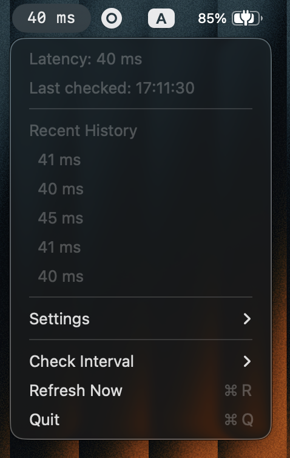

# Pingers

A minimal macOS Big Sur+ menu bar app that continuously pings 1.1.1.1 and displays current network latency.



## Features

- Real-time latency display in menu bar (e.g., "42 ms")
- Color-coded status indicators:
  - Default text color: <100ms
  - Yellow: 100-199ms
  - Red: ≥200ms or error
- Recent ping history (last 5 results)
- Configurable ping interval (500ms, 1s, 2s, 5s, 10s, 30s, 60s)
- Multiple ping targets (Cloudflare, Google, Quad9) or custom host
- Specific error labels (Timeout, Unreachable, Failed)
- Manual refresh action (Cmd+R)
- Menu bar only (no dock icon)

## Requirements

- macOS 11.0 (Big Sur) or later
- Xcode 14+ with Swift 6 support
- Access to system `/sbin/ping` binary

## Project Structure

```
Pingers/
├── Sources/
│   ├── Pingers/           # Main executable target
│   │   ├── Pingers.swift  # App entry point, UI, menu logic
│   │   └── Info.plist         # App metadata (LSUIElement=true)
│   └── PingersLib/        # Library target (testable)
│       ├── PingService.swift  # Ping execution & parsing
│       └── PingScheduler.swift # Periodic scheduler
├── Tests/
│   └── PingersTests/
│       └── PingServiceTests.swift # Unit tests for parsing
├── assets/
│   └── icons/                 # App and menu bar icons
│       ├── AppIcon.icns
│       ├── menubar-icon.png
│       └── menubar-icon@2x.png
├── Package.swift              # Swift Package Manager definition
├── Makefile                   # Build automation
├── package-app.sh             # Script to create .app bundle
└── README.md
```

## Quick Start

The easiest way to build and package the app:

```bash
# Build and package .app bundle (creates dist/Pingers.app)
make

# Run the app
make run

# Install to /Applications
make install

# Run tests
make test

# Clean build artifacts
make clean

# Show all available commands
make help
```

## Building

### Option 1: Swift Package Manager (Recommended for Development)

```bash
# Build
swift build

# Output location
.build/debug/Pingers
```

**Note**: SPM produces a bare executable without app bundle. For full app bundle with Info.plist/entitlements, use the packaging script (see "Packaging" section below).

### Option 2: Xcode Workspace

```bash
# Build via command line
xcodebuild \
  -workspace .swiftpm/xcode/package.xcworkspace \
  -scheme Pingers \
  -destination 'platform=macOS'

# Built app location
~/Library/Developer/Xcode/DerivedData/pinger-*/Build/Products/Debug/Pingers.app
```

Or open `.swiftpm/xcode/package.xcworkspace` in Xcode and build via UI (Cmd+B).

## Running

### From SPM Build

```bash
# Run directly (no app bundle)
.build/debug/Pingers
```

### From Xcode Build

```bash
# Find the built app
APP_PATH=$(find ~/Library/Developer/Xcode/DerivedData -name "Pingers.app" -type d | head -1)

# Launch
open "$APP_PATH"
```

Or run directly from Xcode (Cmd+R).

### Expected Behavior

- Menu bar shows "Starting..." briefly
- Pings begin automatically every 10 seconds (default)
- Status updates to latency (e.g., "12 ms") or error state
- Click menu bar item to view dropdown with:
  - Current status
  - Last checked timestamp
  - Recent history (last 5 pings)
  - Check Interval submenu
  - Refresh Now action
  - Quit action

## Packaging

To create a proper `.app` bundle for distribution:

### Option 1: Using Makefile (Recommended)

```bash
# Build and package in one command
make package

# Or just use the default target
make
```

### Option 2: Using the packaging script

```bash
./package-app.sh
```

The packaging process:
1. Builds a release-optimized executable via `swift build -c release`
2. Creates the `.app` bundle structure in `dist/Pingers.app`
3. Copies the executable to `Contents/MacOS/`
4. Generates a proper `Info.plist` with LSUIElement=true (menu bar only app)
5. Creates the `PkgInfo` file

**Output**: `dist/Pingers.app`

### Installing

```bash
# Run directly from dist/
open dist/Pingers.app

# Or copy to Applications folder
cp -r dist/Pingers.app /Applications/
open /Applications/Pingers.app
```

**Note**: The app is unsigned (local development only). For distribution, you'll need to configure proper code signing and notarization.

## Testing

```bash
# Run all unit tests
xcodebuild test \
  -workspace .swiftpm/xcode/package.xcworkspace \
  -scheme Pingers-Package \
  -destination 'platform=macOS'

# Or use the Makefile
make test
```

**Test Coverage**:
- Ping output parsing (success, timeout, malformed)
- Latency extraction (whole numbers, decimals, high precision)
- PingResult equality and online status checks

## Architecture

### PingService

- Shells out to `/sbin/ping -c 1 -W 2000 1.1.1.1` via Foundation Process
- 2-second timeout enforced at both ping flag level and app level
- Parses output with regex: `time=(\d+\.?\d*)\s*ms`
- Returns structured `PingResult` enum: `success(latencyMs)`, `timeout`, `networkUnreachable`, `commandFailed(reason)`

### PingScheduler

- Uses `DispatchSourceTimer` for periodic execution
- Configurable interval (default 10s)
- Weak self capture prevents retain cycles
- Cancels cleanly on app termination

### Menu Bar UI

- Built with NSStatusItem (Big Sur compatible)
- SwiftUI-based but bridged via AppDelegate
- Dynamic menu reconstruction on each ping result
- Color coding via NSAttributedString attributes
- UserDefaults persistence for interval preference

## Known Issues

- SPM warns about unhandled Info.plist file (expected; it's used by packaging script to create .app bundle).

## Development Workflow

Using the Makefile:

```bash
# Quick iteration - build and run debug version (no bundle)
make dev

# Run tests
make test

# Build release and package
make package

# Build, package, and launch
make run

# Install to /Applications
make install
```

Manual workflow:

1. **Code changes**: Edit source files in `Sources/`
2. **Build**: `make build` or `swift build` for quick iteration
3. **Test**: `make test`
4. **Package**: `make package` to create .app bundle

## Future Enhancements (Section D - Deferred)

- Graceful handling of missing ping binary
- Permission failure detection and user guidance
- Structured logging with os_log
- Network state transition tracking

## License

This project is licensed under the GNU General Public License v3.0. See [LICENSE](LICENSE) for details.
